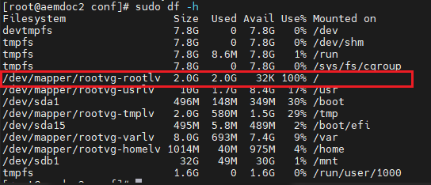

# 扩展Linux逻辑磁盘大小

Error:


### 术语
PV: Physical Volume  
LV: Logical Volume  
VG: Volume Group  

### 问题

**描述**
在我的问题中， the Volume Group Name (VG name) is **rootvg**, the logical volume name (LV name) need extend size is **rootlv**.  
1. 首先， 我为Azure虚拟机添加了一块1T的数据盘。
2. 然后， 运行`fdisk -l`, 查看到新添加的数据盘是/dev/sdd.
3. 然后，创建物理磁盘(physical volume) `pvcreate /dev/sdd`
4. 显示物理磁盘`pvdisplay`
5. 显示逻辑卷名`vgdisplay`
6. 将新物理磁盘添加到vg `vgextend /dev/rootvg /dev/sdd`
7. 使用新的sdd扩展rootlv `lvextend /dev/rootvg/rootlv /dev/sdd`, 提示成功， 如果显示 *Couldn't create temporary archive name*错误， 需要在/中删除点东西，腾出点空间。
8. 再使用`df -l`, 如果没有效果，继续执行以下步骤。
9. `resize2fs /dev/rootvg/rootlv`
10. `xfs_growfs /dev/rootvg/rootlv`

Sample:

```cmd
# show all after crate fdisk command -----------------------------------
[root@localhost ~]# pvdisplay
  PV Rbyn39-R43F-9dIL-D598-ARv6-HN6C-UNsCzD not recognised. Is the device missing?
  PV Rbyn39-R43F-9dIL-D598-ARv6-HN6C-UNsCzD not recognised. Is the device missing?
  --- Physical volume ---
  PV Name               /dev/sda2
  VG Name               rhel
  PV Size               31.51 GiB / not usable 3.00 MiB
  Allocatable           yes (but full)
  PE Size               4.00 MiB
  Total PE              8066
  Free PE               0
  Allocated PE          8066
  PV UUID               bdaYMp-UQB8-bSFf-UGk1-TYhP-mow6-SLNkuQ
   
  PV Rbyn39-R43F-9dIL-D598-ARv6-HN6C-UNsCzD not recognised. Is the device missing?
  --- Physical volume ---
  PV Name               unknown device
  VG Name               rhel
  PV Size               468.00 GiB / not usable 4.00 MiB
  Allocatable           yes 
  PE Size               4.00 MiB
  Total PE              119807
  Free PE               119807
  Allocated PE          0
  PV UUID               Rbyn39-R43F-9dIL-D598-ARv6-HN6C-UNsCzD
   
  "/dev/sda3" is a new physical volume of "468.00 GiB"
  --- NEW Physical volume ---
  PV Name               /dev/sda3
  VG Name               
  PV Size               468.00 GiB
  Allocatable           NO
  PE Size               0   
  Total PE              0
  Free PE               0
  Allocated PE          0
  PV UUID               3ycy21-P5OL-YKYu-zz4c-wnCB-hsx6-vYnaDt

[root@localhost ~]# vgdisplay
  PV Rbyn39-R43F-9dIL-D598-ARv6-HN6C-UNsCzD not recognised. Is the device missing?
  PV Rbyn39-R43F-9dIL-D598-ARv6-HN6C-UNsCzD not recognised. Is the device missing?
  --- Volume group ---
  VG Name               rhel
  System ID             
  Format                lvm2
  Metadata Areas        1
  Metadata Sequence No  4
  VG Access             read/write
  VG Status             resizable
  MAX LV                0
  Cur LV                2
  Open LV               2
  Max PV                0
  Cur PV                2
  Act PV                1
  VG Size               499.50 GiB
  PE Size               4.00 MiB
  Total PE              127873
  Alloc PE / Size       8066 / 31.51 GiB
  Free  PE / Size       119807 / 468.00 GiB
  VG UUID               TRdEsL-YK5v-0iG7-fMvI-XPyy-Rzpb-LxFbgb
   
[root@localhost ~]# pvscan
  PV Rbyn39-R43F-9dIL-D598-ARv6-HN6C-UNsCzD not recognised. Is the device missing?
  PV Rbyn39-R43F-9dIL-D598-ARv6-HN6C-UNsCzD not recognised. Is the device missing?
  PV /dev/sda2        VG rhel            lvm2 [31.51 GiB / 0    free]
  PV unknown device   VG rhel            lvm2 [468.00 GiB / 468.00 GiB free]
  PV /dev/sda3                           lvm2 [468.00 GiB]
  Total: 3 [967.50 GiB] / in use: 2 [499.50 GiB] / in no VG: 1 [468.00 GiB]

# remove missing from vg ------------------------------------------------
[root@localhost ~]# vgreduce --removemissing --force rhel
  PV Rbyn39-R43F-9dIL-D598-ARv6-HN6C-UNsCzD not recognised. Is the device missing?
  PV Rbyn39-R43F-9dIL-D598-ARv6-HN6C-UNsCzD not recognised. Is the device missing?
  Wrote out consistent volume group rhel

[root@localhost ~]# pvdisplay
  --- Physical volume ---
  PV Name               /dev/sda2
  VG Name               rhel
  PV Size               31.51 GiB / not usable 3.00 MiB
  Allocatable           yes (but full)
  PE Size               4.00 MiB
  Total PE              8066
  Free PE               0
  Allocated PE          8066
  PV UUID               bdaYMp-UQB8-bSFf-UGk1-TYhP-mow6-SLNkuQ
   
  "/dev/sda3" is a new physical volume of "468.00 GiB"
  --- NEW Physical volume ---
  PV Name               /dev/sda3
  VG Name               
  PV Size               468.00 GiB
  Allocatable           NO
  PE Size               0   
  Total PE              0
  Free PE               0
  Allocated PE          0
  PV UUID               3ycy21-P5OL-YKYu-zz4c-wnCB-hsx6-vYnaDt
   
[root@localhost ~]# vgdisplay
  --- Volume group ---
  VG Name               rhel
  System ID             
  Format                lvm2
  Metadata Areas        1
  Metadata Sequence No  5
  VG Access             read/write
  VG Status             resizable
  MAX LV                0
  Cur LV                2
  Open LV               2
  Max PV                0
  Cur PV                1
  Act PV                1
  VG Size               31.51 GiB
  PE Size               4.00 MiB
  Total PE              8066
  Alloc PE / Size       8066 / 31.51 GiB
  Free  PE / Size       0 / 0   
  VG UUID               TRdEsL-YK5v-0iG7-fMvI-XPyy-Rzpb-LxFbgb

# create pv ------------------------------------------------------------
[root@localhost ~]# pvcreate /dev/sda3
  Physical volume "/dev/sda3" successfully created

[root@localhost ~]# pvdisplay
  --- Physical volume ---
  PV Name               /dev/sda2
  VG Name               rhel
  PV Size               31.51 GiB / not usable 3.00 MiB
  Allocatable           yes (but full)
  PE Size               4.00 MiB
  Total PE              8066
  Free PE               0
  Allocated PE          8066
  PV UUID               bdaYMp-UQB8-bSFf-UGk1-TYhP-mow6-SLNkuQ
   
  "/dev/sda3" is a new physical volume of "468.00 GiB"
  --- NEW Physical volume ---
  PV Name               /dev/sda3
  VG Name               
  PV Size               468.00 GiB
  Allocatable           NO
  PE Size               0   
  Total PE              0
  Free PE               0
  Allocated PE          0
  PV UUID               fl2Lhs-kIpW-9qH9-VS9Y-2xA0-uKr0-GUYZLm

# extend vg ------------------------------------------------------------
[root@localhost ~]# vgextend /dev/rhel /dev/sda3
  Volume group "rhel" successfully extended

[root@localhost ~]# vgdisplay
  --- Volume group ---
  VG Name               rhel
  System ID             
  Format                lvm2
  Metadata Areas        2
  Metadata Sequence No  6
  VG Access             read/write
  VG Status             resizable
  MAX LV                0
  Cur LV                2
  Open LV               2
  Max PV                0
  Cur PV                2
  Act PV                2
  VG Size               499.50 GiB
  PE Size               4.00 MiB
  Total PE              127873
  Alloc PE / Size       8066 / 31.51 GiB
  Free  PE / Size       119807 / 468.00 GiB
  VG UUID               TRdEsL-YK5v-0iG7-fMvI-XPyy-Rzpb-LxFbgb

# show lv size ---------------------------------------------------------
[root@localhost ~]# lvdisplay
  --- Logical volume ---
  LV Path                /dev/rhel/swap
  LV Name                swap
  VG Name                rhel
  LV UUID                X0Th3D-SZty-2rDO-JGm3-zuOw-ydoi-QXrzRG
  LV Write Access        read/write
  LV Creation host, time localhost, 2017-05-17 01:55:54 +0700
  LV Status              available
  # open                 2
  LV Size                3.02 GiB
  Current LE             772
  Segments               1
  Allocation             inherit
  Read ahead sectors     auto
  - currently set to     256
  Block device           253:1
   
  --- Logical volume ---
  LV Path                /dev/rhel/root
  LV Name                root
  VG Name                rhel
  LV UUID                kWHVMz-X2Tl-b3vT-vNWG-NSSs-Ihq4-C4vxiD
  LV Write Access        read/write
  LV Creation host, time localhost, 2017-05-17 01:55:54 +0700
  LV Status              available
  # open                 1
  LV Size                28.49 GiB
  Current LE             7294
  Segments               1
  Allocation             inherit
  Read ahead sectors     auto
  - currently set to     256
  Block device           253:0

# extend lv size -------------------------------------------------------
[root@localhost ~]# lvextend /dev/rhel/root /dev/sda3
  Extending logical volume root to 496.49 GiB
  Logical volume root successfully resized

# show the new size ----------------------------------------------------
[root@localhost ~]# lvdisplay
  --- Logical volume ---
  LV Path                /dev/rhel/swap
  LV Name                swap
  VG Name                rhel
  LV UUID                X0Th3D-SZty-2rDO-JGm3-zuOw-ydoi-QXrzRG
  LV Write Access        read/write
  LV Creation host, time localhost, 2017-05-17 01:55:54 +0700
  LV Status              available
  # open                 2
  LV Size                3.02 GiB
  Current LE             772
  Segments               1
  Allocation             inherit
  Read ahead sectors     auto
  - currently set to     256
  Block device           253:1
   
  --- Logical volume ---
  LV Path                /dev/rhel/root
  LV Name                root
  VG Name                rhel
  LV UUID                kWHVMz-X2Tl-b3vT-vNWG-NSSs-Ihq4-C4vxiD
  LV Write Access        read/write
  LV Creation host, time localhost, 2017-05-17 01:55:54 +0700
  LV Status              available
  # open                 1
  LV Size                496.49 GiB
  Current LE             127101
  Segments               2
  Allocation             inherit
  Read ahead sectors     auto
  - currently set to     8192
  Block device           253:0

# show with df ---------------------------------------------------------
[root@localhost ~]# df -h
Filesystem             Size  Used Avail Use% Mounted on
/dev/mapper/rhel-root   29G  5.2G   24G  19% /
devtmpfs               123G     0  123G   0% /dev
tmpfs                  123G  128K  123G   1% /dev/shm
tmpfs                  123G  8.9M  123G   1% /run
tmpfs                  123G     0  123G   0% /sys/fs/cgroup
/dev/sda1              497M  119M  379M  24% /boot
/dev/sr0               3.5G  3.5G     0 100% /run/media/exsys/RHEL-7.0 Server.x86_64

#the size only 29GB

# using resize2fs to make use of this space ----------------------------
[root@localhost ~]# resize2fs /dev/rhel/root 
resize2fs 1.42.9 (28-Dec-2013)
resize2fs: Bad magic number in super-block while trying to open /dev/rhel/root
Couldn't find valid filesystem superblock.

# ok error next using xfs_growfs to get free space ---------------------------
[root@localhost ~]# xfs_growfs /dev/rhel/root 
meta-data=/dev/mapper/rhel-root  isize=256    agcount=4, agsize=1867264 blks
         =                       sectsz=512   attr=2, projid32bit=1
         =                       crc=0
data     =                       bsize=4096   blocks=7469056, imaxpct=25
         =                       sunit=0      swidth=0 blks
naming   =version 2              bsize=4096   ascii-ci=0 ftype=0
log      =internal               bsize=4096   blocks=3647, version=2
         =                       sectsz=512   sunit=0 blks, lazy-count=1
realtime =none                   extsz=4096   blocks=0, rtextents=0
data blocks changed from 7469056 to 130151424

# check lagi -----------------------------------------------------------
[root@localhost ~]# df -h
Filesystem             Size  Used Avail Use% Mounted on
/dev/mapper/rhel-root  497G  5.2G  492G   2% /
devtmpfs               123G     0  123G   0% /dev
tmpfs                  123G  128K  123G   1% /dev/shm
tmpfs                  123G  8.9M  123G   1% /run
tmpfs                  123G     0  123G   0% /sys/fs/cgroup
/dev/sda1              497M  119M  379M  24% /boot
/dev/sr0               3.5G  3.5G     0 100% /run/media/exsys/RHEL-7.0 Server.x86_64

```
